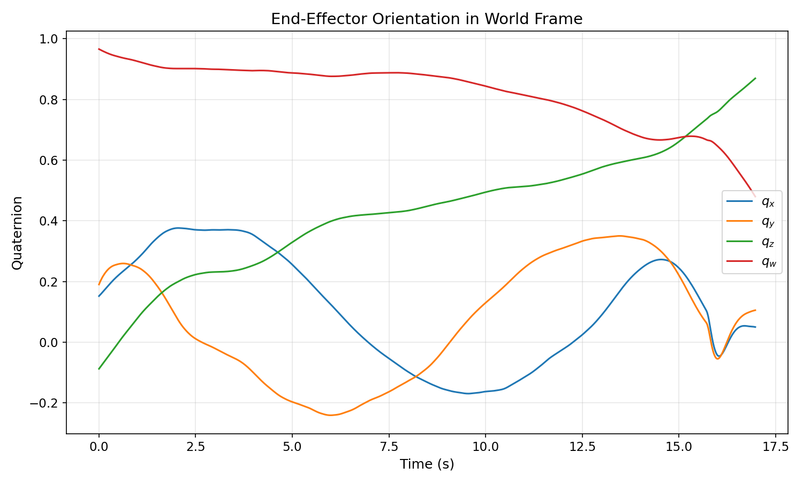

# 题目1解答：坐标系转换

## 计算思路

已知：
- 无人机姿态（World → Body）：${}^W R_B$，由 `tracking.csv` 四元数给出
- 执行器相对机体姿态（Body → Device）：${}^B R_D$，题目公式给出

执行器在世界系下的姿态为：
$${}^W R_D = {}^W R_B \cdot {}^B R_D$$

其中：
$${}^B R_D = \begin{bmatrix} \cos\omega t & -\sin\omega t \cos\alpha & \sin\omega t \sin\alpha \\ \sin\omega t & \cos\omega t \cos\alpha & -\cos\omega t \sin\alpha \\ 0 & \sin\alpha & \cos\alpha \end{bmatrix}$$

参数：$\omega = 0.5\ \text{rad/s}$，$\alpha = \pi/12$

计算流程：
1. 读取每个时刻的无人机四元数，转换为旋转矩阵 ${}^W R_B$
2. 计算对应时刻的 ${}^B R_D$
3. 矩阵相乘得 ${}^W R_D$，转回四元数
4. 若 $q_w < 0$，取反以保证连续性

## 四元数变化曲线

