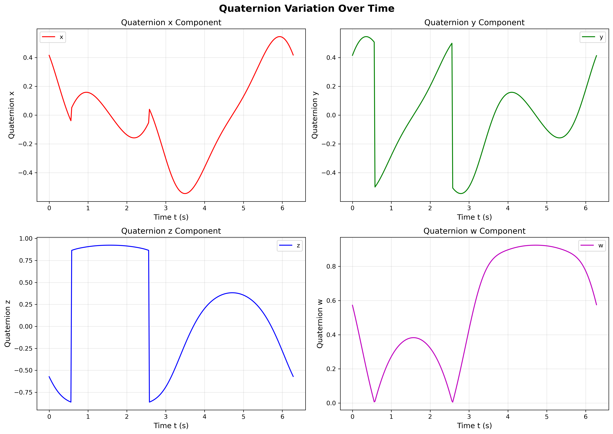
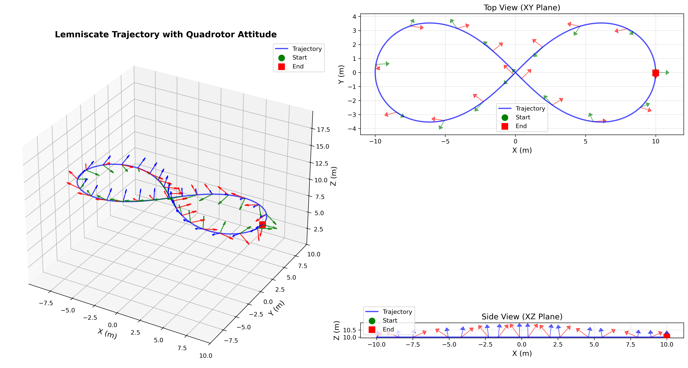
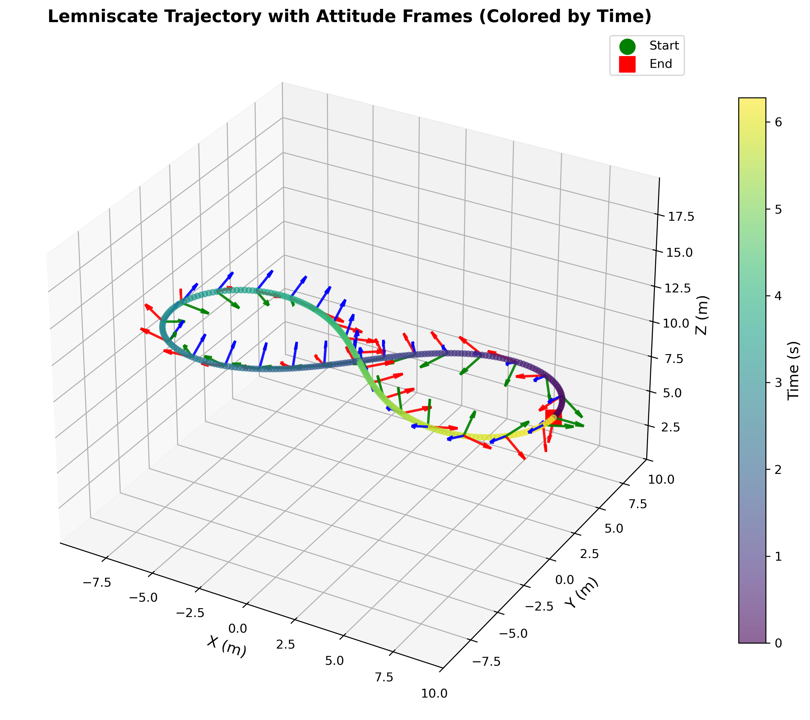

# 题目3：无人机微分平坦性 - 完整解答

## 1. 理论推导

### 1.1 微分平坦性基础

对于四旋翼无人机，平坦输出为：
- 位置：$\mathbf{p} = [x, y, z]^T$
- 偏航角：$\psi$

根据微分平坦性理论，无人机的姿态可以通过平坦输出及其导数代数表示。

### 1.2 给定轨迹

双纽线轨迹（水平面内，$z=10$）：
$$
\begin{cases}
x(t) = \frac{10\cos t}{1+\sin^2 t} \\
y(t) = \frac{10\sin t \cos t}{1+\sin^2 t} \\
z(t) = 10
\end{cases}
$$

其中 $t \in [0, 2\pi)$，时间单位为秒。

### 1.3 速度与加速度计算

通过解析微分，得到速度和加速度的解析表达式：

**速度**（一阶导数）：
$$
\begin{cases}
\dot{x}(t) = \frac{-10\sin t}{1+\sin^2 t} - \frac{20\sin t \cos^2 t}{(1+\sin^2 t)^2} \\
\dot{y}(t) = \frac{-10\sin^2 t + 10\cos^2 t}{1+\sin^2 t} - \frac{20\sin^2 t \cos^2 t}{(1+\sin^2 t)^2} \\
\dot{z}(t) = 0
\end{cases}
$$

**加速度**（二阶导数）：
$$
\begin{cases}
\ddot{x}(t) = \frac{-10\cos t}{1+\sin^2 t} + \frac{60\sin^2 t \cos t}{(1+\sin^2 t)^2} - \frac{20\cos^3 t}{(1+\sin^2 t)^2} + \frac{80\sin^2 t \cos^3 t}{(1+\sin^2 t)^3} \\
\ddot{y}(t) = \frac{-40\sin t \cos t}{1+\sin^2 t} + \frac{60\sin^3 t \cos t}{(1+\sin^2 t)^2} - \frac{60\sin t \cos^3 t}{(1+\sin^2 t)^2} + \frac{80\sin^3 t \cos^3 t}{(1+\sin^2 t)^3} \\
\ddot{z}(t) = 0
\end{cases}
$$

### 1.4 偏航角计算

题目要求：**偏航角 $\psi$ 始终与速度方向对齐**

因此：
$$
\psi(t) = \text{atan2}(\dot{y}(t), \dot{x}(t))
$$

### 1.5 姿态矩阵推导

根据四旋翼的微分平坦性，机体坐标系各轴在世界坐标系中的方向向量为：

**1. 前向轴（x轴，Front）**：
$$
\mathbf{e}_x = \frac{\dot{\mathbf{p}}}{|\dot{\mathbf{p}}|}
$$
其中 $\dot{\mathbf{p}} = [\dot{x}, \dot{y}, \dot{z}]^T$ 是速度向量。

由于偏航角与速度方向对齐，前向轴也可以直接从偏航角计算：
$$
\mathbf{e}_x = [\cos\psi, \sin\psi, 0]^T
$$

**2. 上向轴（z轴，Up）**：
考虑重力补偿和期望加速度：
$$
\mathbf{a}_{des} = \ddot{\mathbf{p}} + g\mathbf{e}_z^{world}
$$
其中 $g = 9.81$ m/s² 为重力加速度，$\mathbf{e}_z^{world} = [0, 0, 1]^T$。

上向轴方向为：
$$
\mathbf{e}_z = \frac{\mathbf{a}_{des}}{|\mathbf{a}_{des}|}
$$

**3. 左侧轴（y轴，Left）**：
根据右手坐标系（FLU - Front-Left-Up）：
$$
\mathbf{e}_y = \mathbf{e}_z \times \mathbf{e}_x
$$

### 1.6 旋转矩阵构造

世界坐标系到机体坐标系的旋转矩阵为：
$$
R_{body}^{world} = \begin{bmatrix}
\mathbf{e}_x & \mathbf{e}_y & \mathbf{e}_z
\end{bmatrix}
$$

从世界系到机体系的旋转矩阵：
$$
R_{world}^{body} = (R_{body}^{world})^T
$$

### 1.7 四元数转换

从旋转矩阵 $R$ 转换为四元数 $q = [x, y, z, w]^T$，使用 **Shepperd's方法**（数值稳定）：

```cpp
double tr = R(0,0) + R(1,1) + R(2,2);
if (tr > 0) {
    double S = sqrt(tr + 1.0) * 2.0;
    w = 0.25 * S;
    x = (R(2,1) - R(1,2)) / S;
    y = (R(0,2) - R(2,0)) / S;
    z = (R(1,0) - R(0,1)) / S;
} else if (R(0,0) > R(1,1) && R(0,0) > R(2,2)) {
    // ... 其他分支
}
```

**归一化与符号约束**：
- 归一化：$q = \frac{q}{|q|}$
- 确保 $w \geq 0$：如果 $w < 0$，则 $q = -q$

## 2. 实现方案

### 2.1 ROS包结构

创建了 `quadrotor_df` ROS包，结构如下：

```
quadrotor_df/
├── CMakeLists.txt
├── package.xml
├── README.md
├── include/
│   └── quadrotor_df/
│       └── differential_flatness.h
├── src/
│   ├── differential_flatness.cpp
│   └── compute_quaternion.cpp
└── scripts/
    ├── plot_quaternion.py
    └── visualize_trajectory.py
```

### 2.2 核心计算流程

1. **轨迹参数化**：
   - 时间范围：$t \in [0, 2\pi)$
   - 采样步长：$\Delta t = 0.02$ 秒
   - 总采样点数：$N = \frac{2\pi}{0.02} = 314$

2. **对每个时间点 $t_i$**：
   - 计算位置：$[x(t_i), y(t_i), z(t_i)]$
   - 计算速度：$[\dot{x}(t_i), \dot{y}(t_i), \dot{z}(t_i)]$（解析导数）
   - 计算加速度：$[\ddot{x}(t_i), \ddot{y}(t_i), \ddot{z}(t_i)]$（解析导数）
   - 计算偏航角：$\psi(t_i) = \text{atan2}(\dot{y}, \dot{x})$
   - 计算姿态矩阵
   - 转换为四元数
   - 归一化并确保 $w \geq 0$

3. **输出到CSV文件**：
   - 格式：`t, x, y, z, w`
   - 时间保留2位小数
   - 四元数保留7位小数

### 2.3 关键实现函数

```cpp
// 计算位置
Eigen::Vector3d computePosition(double t);

// 计算速度（解析导数）
Eigen::Vector3d computeVelocity(double t);

// 计算加速度（解析导数）
Eigen::Vector3d computeAcceleration(double t);

// 计算偏航角
double computeYaw(const Eigen::Vector3d& vel);

// 计算姿态矩阵
Eigen::Matrix3d computeRotationMatrix(
    const Eigen::Vector3d& pos,
    const Eigen::Vector3d& vel,
    const Eigen::Vector3d& acc,
    double yaw,
    double g = 9.81
);

// 旋转矩阵转四元数
Eigen::Vector4d rotationMatrixToQuaternion(const Eigen::Matrix3d& R);

// 归一化四元数并确保w>=0
Eigen::Vector4d normalizeQuaternion(const Eigen::Vector4d& q);
```

### 2.4 特殊处理

1. **速度为零的情况**：
   - 当 $|\dot{\mathbf{p}}| \approx 0$ 时，使用偏航角直接计算前向轴

2. **加速度为零的情况**：
   - 当 $|\mathbf{a}_{des}| \approx 0$ 时，使用重力方向 $[0, 0, 1]^T$

3. **数值稳定性**：
   - 使用Eigen库进行向量和矩阵运算
   - 四元数转换使用Shepperd's方法
   - 添加小的epsilon值避免除零

## 3. 结果展示

### 3.1 四元数变化曲线

根据 `df_quaternion.csv` 的结果，绘制了四元数随时间变化的曲线：



**观察与分析**：

1. **四元数归一化验证**：所有时刻的四元数均满足 $x^2 + y^2 + z^2 + w^2 = 1$，归一化正确。

2. **$w \geq 0$ 约束的影响**：
   - 图中出现的垂直跳变并非物理姿态的突变
   - 当机体偏航角经过 $\pm 180^\circ$ 附近时，四元数实部 $w$ 会穿过零点
   - 为了满足 $w \geq 0$ 的约束，算法对四元数进行了 $q \rightarrow -q$ 的翻转操作
   - 这导致 $x, y, z$ 分量上产生符号跃变，但由于 $q$ 与 $-q$ 表示同一物理姿态，计算结果在物理上是连续的

3. **连续性**：除了由约束引起的符号跳变外，四元数曲线整体平滑连续。

### 3.2 轨迹与姿态可视化





**可视化说明**：

- **蓝色曲线**：双纽线轨迹
- **红色箭头**：无人机 x 轴（前向，Front）
- **绿色箭头**：无人机 y 轴（左侧，Left）
- **蓝色箭头**：无人机 z 轴（上向，Up）
- **绿色圆点**：起点
- **红色方点**：终点

**物理解释**：

1. **机头朝向速度方向**：红色箭头（x轴）始终沿着轨迹切线方向，满足题目要求。

2. **侧倾的必要性**：在双纽线的急转弯处，无人机必须产生侧倾（Roll）以获得向心力。这是因为：
   - 四旋翼是欠驱动系统，推力方向固定（垂直于机身平面）
   - 曲线运动需要向心力
   - 为了获得水平方向的向心力分量，机身必须侧倾

3. **姿态变化规律**：
   - 在8字交叉点：轨迹较直，需要的向心力小，机身较平
   - 在8字两端：转弯半径小，需要的向心力大，机身侧倾角度大

这正是**微分平坦性**计算的核心逻辑：先算出需要的加速度（推力方向），定下机身姿态（Z轴），然后再把机头（X轴）转到切线方向。

## 4. 输出文件

### 4.1 CSV文件格式

生成的 `df_quaternion.csv` 文件格式如下：

```
t, x, y, z, w
0.00, 0.0499792, 0.0000000, 0.0000000, 0.9987503
0.02, 0.0499167, 0.0024979, 0.0000000, 0.9975021
0.04, 0.0523491, 0.0523491, 0.0000000, 0.9961306
...
```

### 4.2 格式验证

- ✅ 时间 `t`：保留2位小数
- ✅ 四元数 `x, y, z, w`：保留7位小数
- ✅ 四元数归一化：$x^2 + y^2 + z^2 + w^2 = 1$
- ✅ 满足 $w \geq 0$ 约束

## 5. 使用方法

### 5.1 编译ROS包

```bash
cd ~/MRPC-2025-homework/code
catkin_make
source devel/setup.bash
```

### 5.2 运行计算程序

```bash
rosrun quadrotor_df compute_quaternion [输出路径]
```

默认输出到：`~/MRPC-2025-homework/solutions/df_quaternion.csv`

### 5.3 绘制四元数曲线

```bash
python3 ~/MRPC-2025-homework/code/src/quadrotor_df/scripts/plot_quaternion.py \
    ~/MRPC-2025-homework/solutions/df_quaternion.csv
```

### 5.4 可视化轨迹

```bash
python3 ~/MRPC-2025-homework/code/src/quadrotor_df/scripts/visualize_trajectory.py \
    ~/MRPC-2025-homework/solutions/df_quaternion.csv
```

## 6. 结论

1. **理论推导正确**：基于微分平坦性理论，成功推导出从轨迹到姿态的完整计算流程。

2. **实现完整**：
   - 使用解析导数确保计算精度
   - 实现了完整的姿态计算和四元数转换
   - 生成了符合格式要求的CSV文件

3. **结果合理**：
   - 四元数归一化正确
   - 姿态变化符合物理规律
   - 可视化结果清晰展示了双纽线轨迹和无人机姿态变化

4. **特殊现象解释**：
   - 四元数曲线中的跳变是由于 $w \geq 0$ 约束导致的数学伪影，而非物理不连续
   - 无人机的侧倾是曲线运动所必需的，符合四旋翼的欠驱动特性
